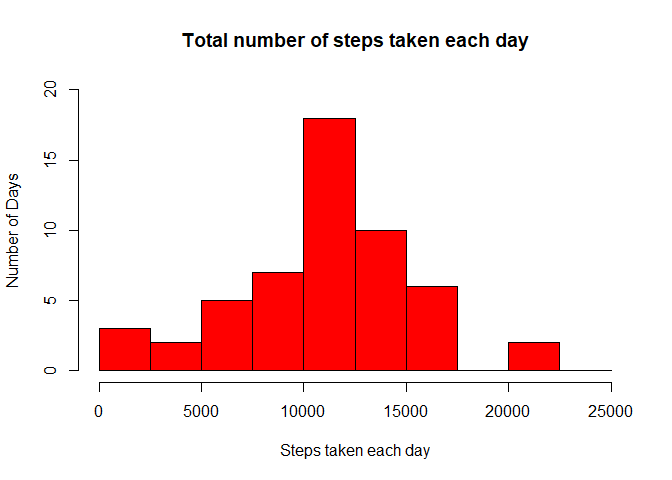
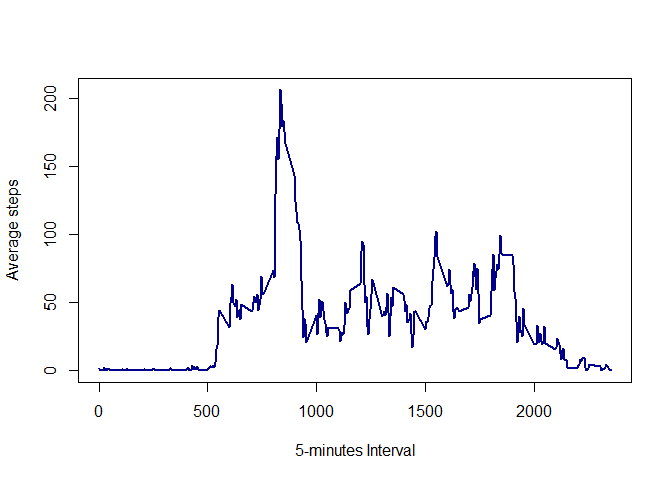
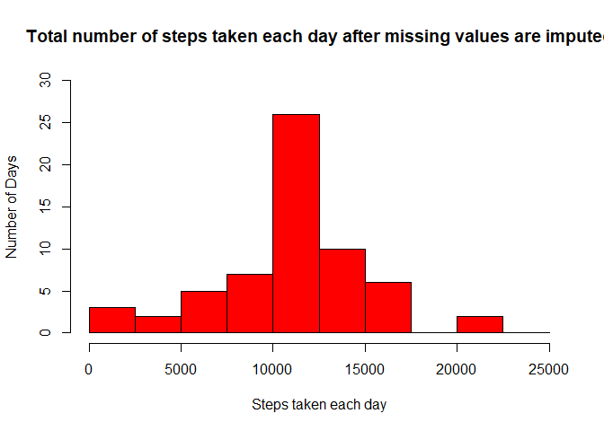
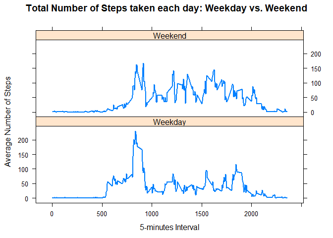

Loading and preprocessing the data
----------------------------------

    library(dplyr)

    ## 
    ## Attaching package: 'dplyr'

    ## The following objects are masked from 'package:stats':
    ## 
    ##     filter, lag

    ## The following objects are masked from 'package:base':
    ## 
    ##     intersect, setdiff, setequal, union

    library(lattice)
    fileURL = "https://d396qusza40orc.cloudfront.net/repdata%2Fdata%2Factivity.zip"
    download.file(fileURL, destfile = "./data activity.zip")
    unzip(zipfile = "./data activity.zip")
    data <- read.csv("./activity.csv")
    data$date <- as.Date(data$date, "%Y-%m-%d")

What is mean total number of steps taken per day?
-------------------------------------------------

1.  Calculate the total number of steps taken per day

<!-- -->

    steps.per.day <- data %>% group_by(date) %>% summarise(total = sum(steps))

1.  Make a histogram of the total number of steps taken each day

<!-- -->

    hist(steps.per.day$total, col = "red", breaks = seq(0,25000, by=2500), main = "Total number of steps taken each day", xlab = "Steps taken each day", ylab = "Number of Days", xlim = c(0,25000), ylim = c(0, 20))

1.  Calculate and report the mean and median of the total number of
    steps taken per day

<!-- -->

    mean(steps.per.day$total, na.rm = TRUE)

    ## [1] 10766.19

    median(steps.per.day$total, na.rm = TRUE)

    ## [1] 10765

What is the average daily activity pattern?
-------------------------------------------

1.Make a time series plot (i.e. type = “l” of the 5-minute interval
(x-axis) and the average number of steps taken, averaged across all days
(y-axis)

    int.mean.SPD <- data %>% group_by(interval) %>% summarise(Mean = mean(steps, na.rm = TRUE))
    with(data = int.mean.SPD, plot(x = interval, y = Mean, type = "l", col="darkblue", lwd = 2, xlab = "5-minutes Interval", ylab = "Average steps"))

1.  Which 5-minute interval, on average across all the days in the
    dataset, contains the maximum number of steps?

<!-- -->

    int.mean.SPD[int.mean.SPD$Mean == max(int.mean.SPD$Mean),]

    ## # A tibble: 1 x 2
    ##   interval  Mean
    ##      <int> <dbl>
    ## 1      835  206.

Imputing missing values
-----------------------

1.  Calculate and report the total number of missing values in the
    dataset (i.e. the total number of rows with NAs)

<!-- -->

    sum(is.na(data$steps))

    ## [1] 2304

1.  Devise a strategy for filling in all of the missing values in the
    dataset. The strategy does not need to be sophisticated. For
    example, you could use the mean/median for that day, or the mean for
    that 5-minute interval, etc.

<!-- -->

    imp.steps <- int.mean.SPD$Mean[match(data$interval, int.mean.SPD$interval)]

1.  Create a new dataset that is equal to the original dataset but with
    the missing data filled in.

<!-- -->

    imp.data <- transform(data, steps = ifelse(test = is.na(data$steps), yes = imp.steps, no = data$steps))

1.  Make a histogram of the total number of steps taken each day and
    Calculate and report the mean and median total number of steps taken
    per day. Do these values differ from the estimates from the first
    part of the assignment? What is the impact of imputing missing data
    on the estimates of the total daily number of steps?

<!-- -->

    imp.SPD <- imp.data %>% group_by(date) %>% summarise(total = sum(steps))
    hist(imp.SPD$total, col = "red", breaks = seq(0,25000, by=2500), main = "Total number of steps taken each day after missing values are imputed", xlab = "Steps taken each day", ylab = "Number of Days", xlim = c(0,25000), ylim = c(0, 30))

    mean(imp.SPD$total, na.rm = TRUE)

    ## [1] 10766.19

    median(imp.SPD$total, na.rm = TRUE)

    ## [1] 10766.19

Are there differences in activity patterns between weekdays and weekends?
-------------------------------------------------------------------------

1.  Create a new factor variable in the dataset with two levels –
    “weekday” and “weekend” indicating whether a given date is a weekday
    or weekend day.

<!-- -->

    data.wd <- imp.data %>% mutate(Day.of.Week = weekdays(date)) %>% mutate(Date.Type = ifelse(Day.of.Week == "Saturday" | Day.of.Week == "Sunday", "Weekend", "Weekday"))

1.  Make a panel plot containing a time series plot (i.e. type = “l”) of
    the 5-minute interval (x-axis) and the average number of steps
    taken, averaged across all weekday days or weekend days (y-axis).
    See the README file in the GitHub repository to see an example of
    what this plot should look like using simulated data.

<!-- -->

    panel.mean.SPD <- data.wd %>% group_by(interval, Date.Type) %>% summarise(Mean = mean(steps, na.rm = TRUE))
    with(panel.mean.SPD, xyplot(Mean ~ interval | Date.Type, type = "l", lwd = 2, main = "Total Number of Steps taken each day: Weekday vs. Weekend", xlab = "5-minutes Interval", ylab = "Average Number of Steps", layout=(c(1,2))))

